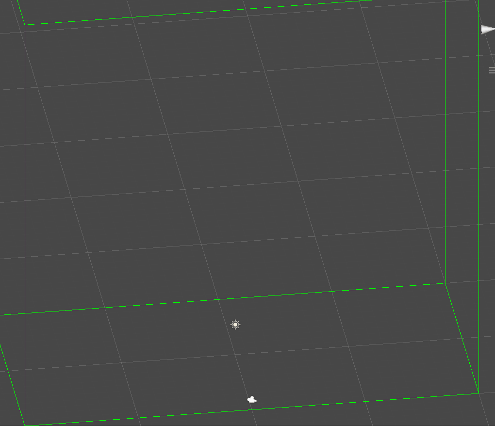

# UnityShapeMatching

## Introduction

This is a Unity implementation of *Meshless Deformations Based on Shape Matching* and *Solid Simulation with Oriented Particles*

For simplicity, I assign one particle to one vertex of the mesh, for a mesh with a larger number of vertices, multiple vertices should share one particle as the paper did.

